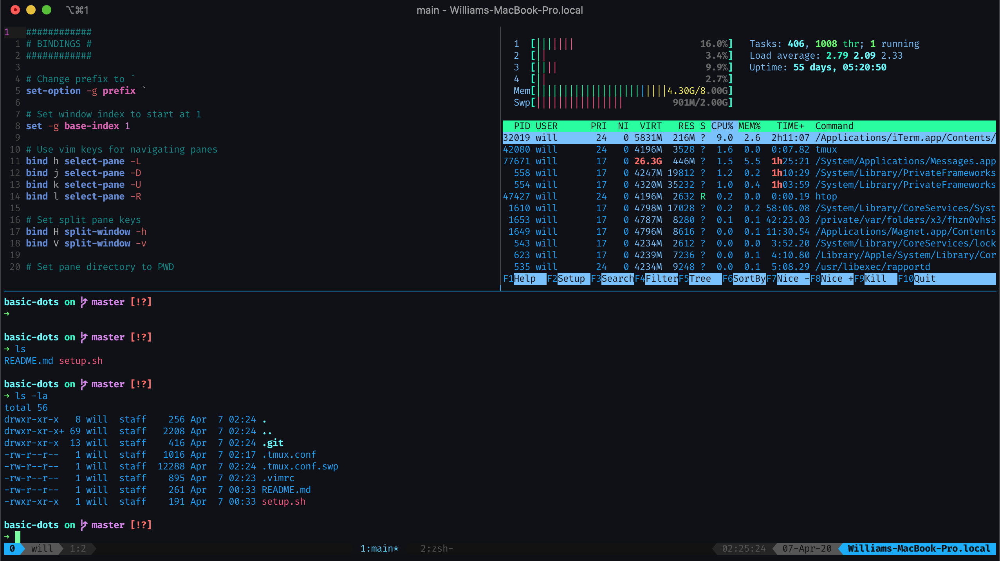

# Basic Dotfiles
## Description
Easily setup a vim/tmux config when working in a new environment

## Content
This repo contains the dotfiles for:
  - vim
  - tmux
  
## Usage
    git clone https://github.com/wmrabb11/basic-dots
    cd basic-dots
    ./setup.sh

## Example

